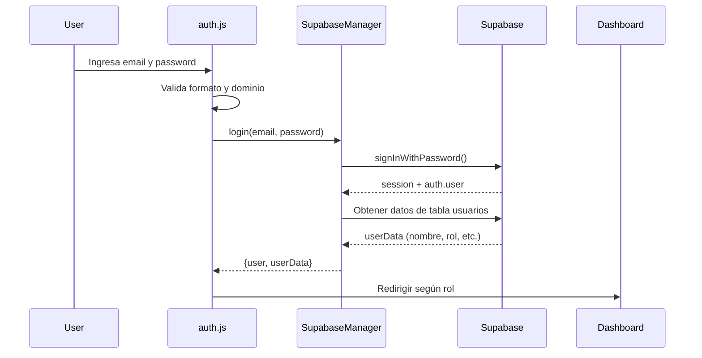
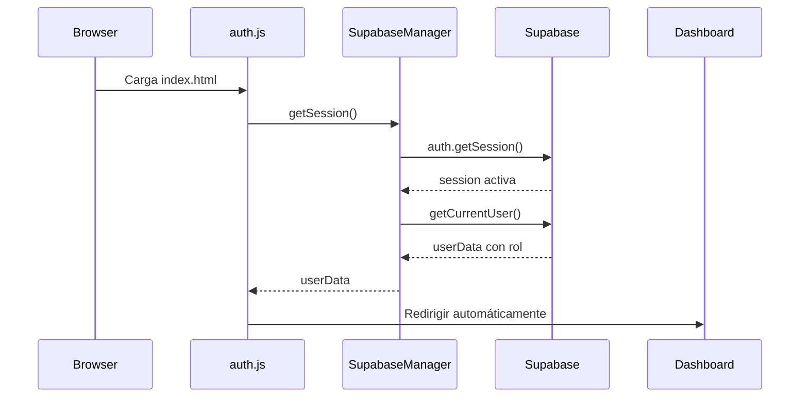

# 📄 Análisis del Código de Autenticación

## ✅ Resumen del Estado

El código de autenticación está **bien implementado** y funcional. Aquí está el análisis detallado:

---

## 📁 Archivos Revisados

### 1. [`js/auth.js`](file:///c:/Users/jesuk/OneDrive/Escritorio/ISTPCAJAS2025_INV/js/auth.js)

**Funcionalidad:** Maneja el formulario de login y autenticación

**✅ Puntos Positivos:**
- Validación completa de email y contraseña
- Auto-completado del dominio institucional (`@institutocajas.edu.pe`)
- Manejo correcto de errores de Supabase
- Redirección automática según el rol del usuario
- Verificación de sesión existente al cargar la página
- Feedback visual al usuario (loading states, mensajes de error)

**🔍 Flujo de Login:**
1. Usuario ingresa email (solo la parte antes del @)
2. Se autocompleta con `@institutocajas.edu.pe`
3. Se valida formato y dominio institucional
4. Se llama a `SupabaseManager.login(email, password)`
5. Si es exitoso, se redirige al dashboard según el rol

**💡 Mejoras Opcionales:**
- Ninguna crítica. El código funciona correctamente.

---

### 2. [`js/supabase-config.js`](file:///c:/Users/jesuk/OneDrive/Escritorio/ISTPCAJAS2025_INV/js/supabase-config.js)

**Funcionalidad:** Configuración de Supabase y manager para operaciones CRUD

**✅ Puntos Positivos:**
- Clase `SupabaseManager` bien organizada
- Métodos para todas las operaciones necesarias:
  - Usuarios: `getUsuarios()`, `createUsuario()`, `updateUsuario()`, `deleteUsuario()`
  - Proyectos: `getProyectos()`, `createProyecto()`, `updateProyecto()`
  - Evaluaciones: `getEvaluaciones()`, `createEvaluacion()`, `updateEvaluacion()`
  - Autenticación: `login()`, `logout()`, `getSession()`, `getCurrentUser()`
  - Configuración: `getConfiguracion()`, `updateConfiguracion()`
- Uso correcto de vistas (`proyectos_completos`, `evaluaciones_completas`)
- Manejo de errores en todos los métodos
- Upload de archivos PDF a Supabase Storage
- Listener de cambios de autenticación (`onAuthStateChange`)

**🔧 Configuración Actual:**
```javascript
const SUPABASE_URL = 'https://wbondpjuxlcxkkkdbzkj.supabase.co';
const SUPABASE_ANON_KEY = 'eyJhbGciOiJIUzI1NiIsInR5cCI6IkpXVCJ9...';
```

**✅ Estado:** Las credenciales están correctamente configuradas

---

### 3. [`js/main.js`](file:///c:/Users/jesuk/OneDrive/Escritorio/ISTPCAJAS2025_INV/js/main.js)

**Funcionalidad:** Funciones globales y utilidades

**✅ Puntos Positivos:**
- Funciones asíncronas para `getCurrentUser()` que usa Supabase
- `logout()` implementado con `SupabaseManager.logout()`
- `checkAuth()` verifica sesión activa
- Funciones de formato y utilidades (fechas, badges, validaciones)

**⚠️ Nota Importante:**
- **Líneas 29-76:** El código inicializa datos de demostración en `localStorage` con usuarios antiguos
- **Este código es legacy** y ya no se usa con Supabase
- NO afecta el funcionamiento, pero podría confundir

**💡 Recomendación Opcional:**
- Comentar o eliminar las líneas 29-76 (`initDemoData()`) ya que Supabase maneja los usuarios

---

## 🔐 Autenticación con Supabase: ¿Cómo Funciona?

### Flujo Completo de Login



### Verificación de Sesión

Cuando el usuario ya tiene sesión abierta:



---

## 🐛 Posibles Errores y Soluciones

### Error 1: "Invalid login credentials"

**Causas:**
1. Email o contraseña incorrectos
2. Usuario no existe en Supabase Auth
3. Usuario no confirmado (si "Confirm email" está activado)
4. Usuario existe en Auth pero NO en la tabla `usuarios`

**Solución:**
```sql
-- Verificar si el usuario existe en la tabla usuarios
SELECT * FROM usuarios WHERE email = 'admin@institutocajas.edu.pe';

-- Si no existe, crearlo (reemplaza UUID_DEL_AUTH_USER)
INSERT INTO usuarios (nombre, apellido, email, rol, auth_user_id)
VALUES ('Admin', 'Sistema', 'admin@institutocajas.edu.pe', 'administrador', 'UUID_AQUI');
```

### Error 2: "Failed to fetch" o problemas CORS

**Causas:**
1. `SUPABASE_URL` o `SUPABASE_ANON_KEY` incorrectos
2. Proyecto de Supabase pausado
3. Problemas de red

**Solución:**
- Verificar credenciales en [`supabase-config.js`](file:///c:/Users/jesuk/OneDrive/Escritorio/ISTPCAJAS2025_INV/js/supabase-config.js)
- Ir a Supabase Dashboard → Settings → API y copiar nuevamente

### Error 3: Usuario logea pero no redirige

**Causa:**
- Usuario existe en Auth pero NO en la tabla `usuarios`

**Solución:**
```javascript
// En la consola del navegador (F12):
const session = await supabase.auth.getSession();
console.log(session); // Ver si hay sesión

const userData = await SupabaseManager.getCurrentUser();
console.log(userData); // Ver si hay datos del usuario
```

---

## 📋 Checklist de Verificación

### Antes de hacer login:

- [ ] Ejecutaste el script `database.sql` en Supabase
- [ ] Creaste el usuario administrador en **Authentication** → **Users**
- [ ] Insertaste el registro en la tabla `usuarios` vinculado al `auth_user_id`
- [ ] Desactivaste "Confirm email" en **Authentication** → **Settings**
- [ ] Verificaste las credenciales en `supabase-config.js`

### Si el login falla:

1. **Abre la consola del navegador** (F12)
2. **Busca errores** en la pestaña Console
3. **Verifica el Network** para ver la respuesta de Supabase
4. **Ejecuta:** `SELECT * FROM usuarios WHERE email = 'admin@institutocajas.edu.pe';` en SQL Editor

---

## ✅ Conclusión

**El código de autenticación está correctamente implementado.** 

Los únicos cambios realizados fueron:
1. ✅ Actualizar la contraseña a `Admin@Cajas2025`
2. ✅ Crear guía de configuración de Supabase
3. ✅ Documentar el análisis del código

**No se requieren cambios en el código de autenticación.**

---

## 📞 Próximos Pasos

1. Seguir la [Guía de Configuración de Supabase](file:///c:/Users/jesuk/OneDrive/Escritorio/ISTPCAJAS2025_INV/GUIA_CONFIGURACION_SUPABASE.md)
2. Crear el usuario administrador con la nueva contraseña
3. Probar el login en la aplicación
4. Si hay errores, revisar la consola del navegador

**¡Todo listo para comenzar! 🚀**
